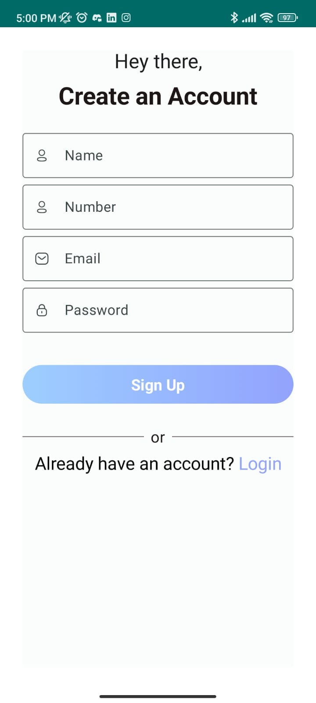
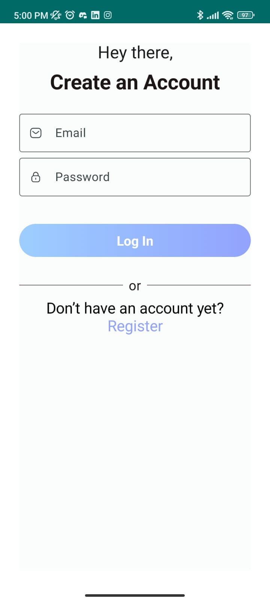
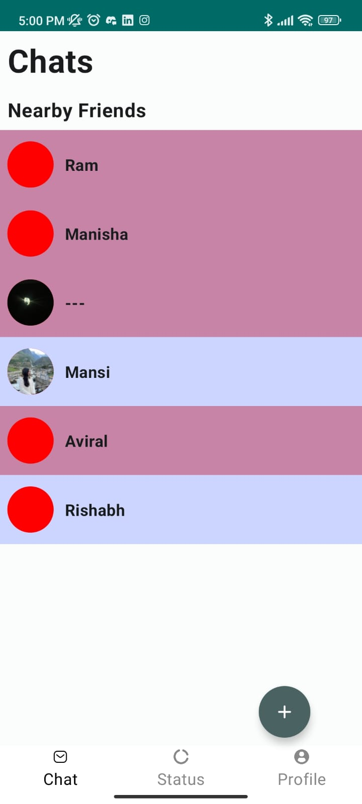

# Pal App

Pal App is a social media platform designed to help users discover and connect with people nearby. The platform enables users to chat and arrange meetups in a safe and easy way.

## Features

- **Real-Time Location Updates**: See users who are nearby in real time.
- **Instant Messaging**: Chat with nearby users instantly and securely.
- **Meetup Arrangements**: Plan and organize meetups with people in your vicinity.
- **Privacy Controls**: Manage who can see your location and interact with you.
- **User Profiles**: Create a profile, add interests, and find like-minded people.
- **Notifications**: Receive alerts for new messages and nearby users.

## Screenshots

## Usage

1. **Create an account** or **log in** to your existing account.
2. **Allow location access** when prompted to discover nearby users.
3. **Start chatting** with people nearby by selecting them from the list.
4. **Arrange meetups** by sending invitations to other users.

## Contributing

We welcome contributions to enhance Nearby Connect! Please follow these steps to contribute:

1. Fork the repository.
2. Create a new branch (`git checkout -b feature/your-feature-name`).
3. Commit your changes (`git commit -m 'Add your feature'`).
4. Push to the branch (`git push origin feature/your-feature-name`).
5. Open a pull request.

## License

This project is licensed under the MIT License - see the [LICENSE](LICENSE) file for details.

## Contact

If you have any questions or suggestions, feel free to reach out at [prakharbhatnagar49@gmail.com](mailto:prakharbhatnagar49@gmail.com).
